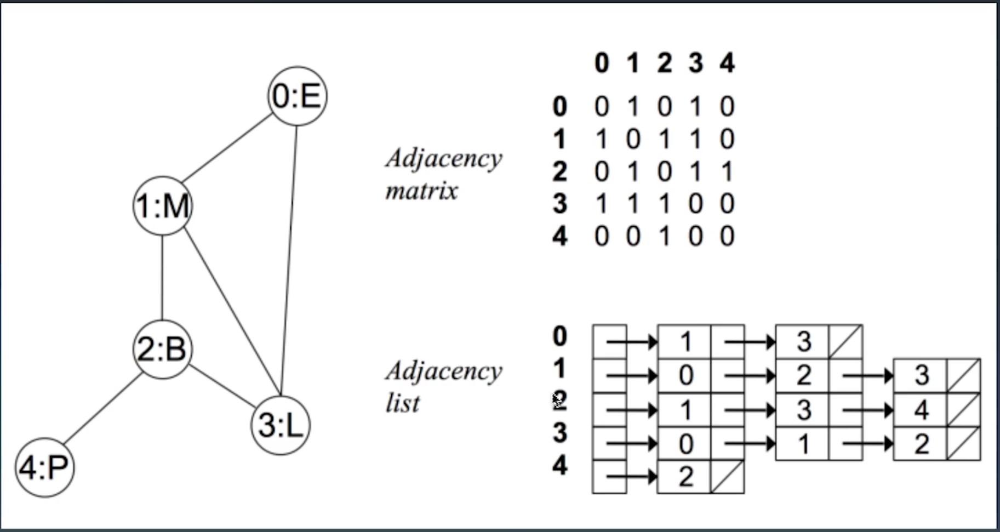

图的知识总结
---
1. 图的属性和分类
- 图的定义：有点有边
- Graph(V,E)
- V - vertex:点
    * 度 - 入度和出度
    * 点与点之间：联通与否
- E - edge:边
    * 有向和无向(单行线，双向度)
    * 权重(边长)
2. 图的表示和分类(以无向无权图表示)
- 邻接数组
- 邻接链表

   
3. 基于图相关的算法
- DFS深度遍历代码 - 递归写法
    * 和树种的DFS最大的区别，不要忘记加visited = set()
    * 代码模板
    ```
    public void bfs(int s, int t) {
      if (s == t) return;
      boolean[] visited = new boolean[v];
      visited[s]=true;
      Queue<Integer> queue = new LinkedList<>();
      queue.add(s);
      int[] prev = new int[v];
      for (int i = 0; i < v; ++i) {
        prev[i] = -1;
      }
      while (queue.size() != 0) {
        int w = queue.poll();
       for (int i = 0; i < adj[w].size(); ++i) {
          int q = adj[w].get(i);
          if (!visited[q]) {
            prev[q] = w;
            if (q == t) {
              print(prev, s, t);
              return;
            }
            visited[q] = true;
            queue.add(q);
          }
        }
      }
    }
    
    private void print(int[] prev, int s, int t) { // 递归打印s->t的路径
      if (prev[t] != -1 && t != s) {
        print(prev, s, prev[t]);
      }
      System.out.print(t + " ");
    }

    ```
- BFS代码 - 递归写法
    * 代码模板 
    ```  
    public void bfs(int s, int t) {
      if (s == t) return;
      boolean[] visited = new boolean[v];
      visited[s]=true;
      Queue<Integer> queue = new LinkedList<>();
      queue.add(s);
      int[] prev = new int[v];
      for (int i = 0; i < v; ++i) {
        prev[i] = -1;
      }
      while (queue.size() != 0) {
        int w = queue.poll();
       for (int i = 0; i < adj[w].size(); ++i) {
          int q = adj[w].get(i);
          if (!visited[q]) {
            prev[q] = w;
            if (q == t) {
              print(prev, s, t);
              return;
            }
            visited[q] = true;
            queue.add(q);
          }
        }
      }
    }
    
    private void print(int[] prev, int s, int t) { // 递归打印s->t的路径
      if (prev[t] != -1 && t != s) {
        print(prev, s, prev[t]);
      }
      System.out.print(t + " ");
    }
    ```
- [连通图个数](https://leetcode-cn.com/problems/number-of-islands/)
- [拓扑排序（Topological Sorting）](https://zhuanlan.zhihu.com/p/34871092)
- [最短路径（Shortest Path）：Dijkstra](https://www.bilibili.com/video/av25829980?from=search&seid=13391343514095937158)
- [最小生成树（Minimum Spanning Tree）](https://www.bilibili.com/video/av84820276?from=search&seid=17476598104352152051)   
   
4. 参考链接
- [深度和广度优先搜索](https://time.geekbang.org/column/article/70891?utm_source=web&utm_medium=pinpaizhuanqu&utm_campaign=baidu&utm_term=pinpaizhuanqu&utm_content=0427)

    
