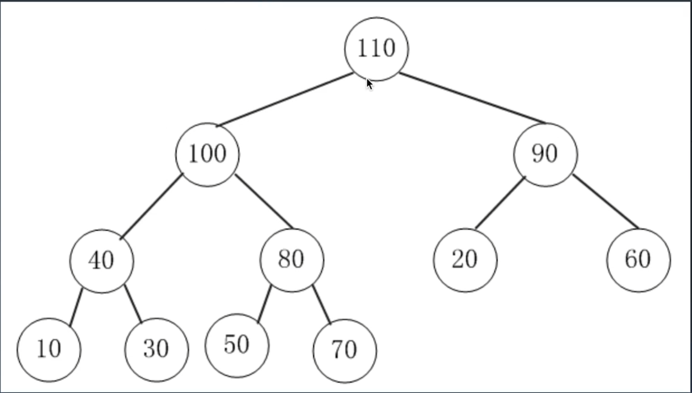
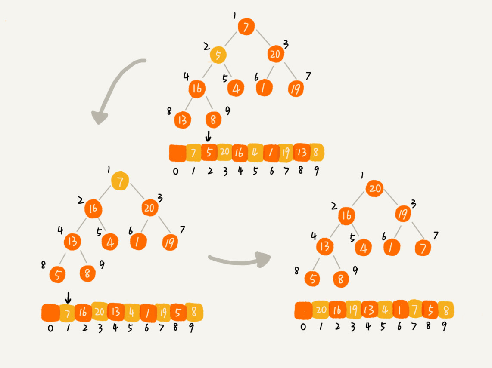
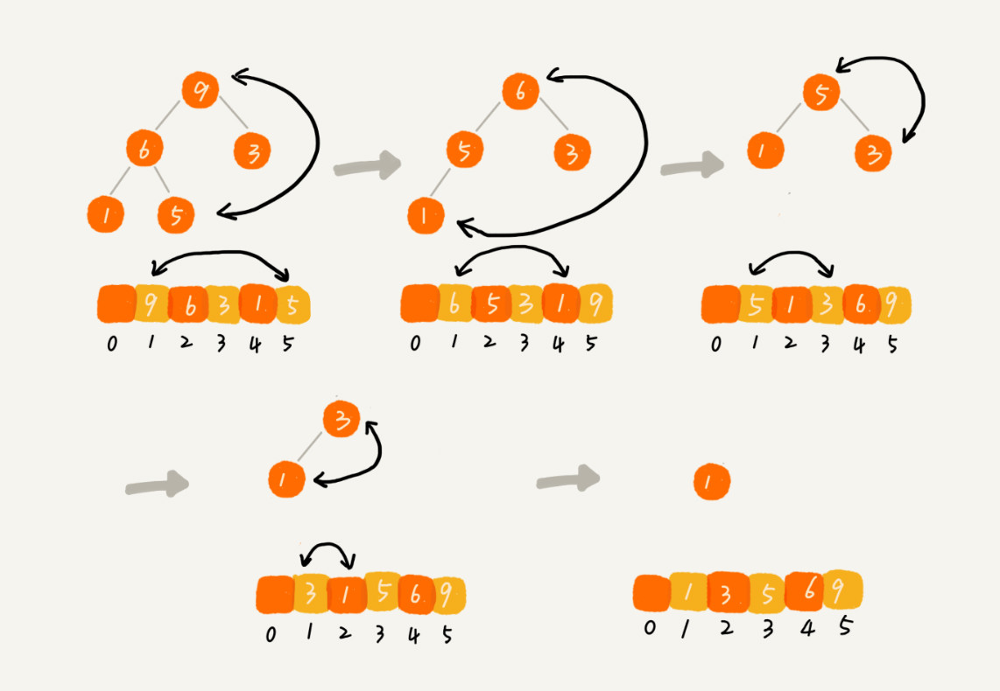

堆和二叉堆的知识总结
---
1. 堆的概念

堆是一种特殊的树，可以迅速的找到一堆数中的最大或者最小值的数据结构。

假设是大顶堆，则常见的操作:
- find-max:O(1)
- delete-max:O(logN)
- insert(create): O(logN) or O(1)

对于每个节点的值都大于等于子树中每个节点值的堆，我们叫做“大顶堆”。对于每个节点的值都小于等于子树中每个节点值的堆，我们叫做“小顶堆” 

2. 二叉堆

- 二叉堆是一个完全二叉树
- 二叉堆中每一个节点的值都必须大于等于（或小于等于）其子树中每个节点的值。

第一点，堆必须是一个完全二叉树。还记得我们之前讲的完全二叉树的定义吗？完全二叉树要求，除了最后一层，其他层的节点个数都是满的，最后一层的节点都靠左排列。

第二点，堆中的每个节点的值必须大于等于（或者小于等于）其子树中每个节点的值。实际上，我们还可以换一种说法，堆中每个节点的值都大于等于（或者小于等于）其左右子节点的值。这两种表述是等价的。

3. 如何实现一个堆

完全二叉树比较适合用数组来存储。用数组来存储完全二叉树是非常节省存储空间的。因为我们不需要存储左右子节点的指针，单纯地通过数组的下标，就可以找到一个节点的左右子节点和父节点。


[110,100,90,40,80,20,60,10,30,50,70]

- 索引为i的左孩子的索引是(2*i + 1)
- 索引为i的右孩子的索引是(2*i + 2)
- 索引为i的父节点的索引是floor((i-1)/2)

4. 二叉树的操作
 
- 插入
    * 放到堆尾
    * 自下往上堆化(heapify),顺着节点所在的路径，向上或者向下，对比然后交换


```
public class Heap {
  private int[] a; // 数组，从下标1开始存储数据
  private int n;  // 堆可以存储的最大数据个数
  private int count; // 堆中已经存储的数据个数

  public Heap(int capacity) {
    a = new int[capacity + 1];
    n = capacity;
    count = 0;
  }

  public void insert(int data) {
    if (count >= n) return; // 堆满了
    ++count;
    a[count] = data;
    int i = count;
    while (i/2 > 0 && a[i] > a[i/2]) { // 自下往上堆化
      swap(a, i, i/2); // swap()函数作用：交换下标为i和i/2的两个元素
      i = i/2;
    }
  }
 }
```
- 删除
    * 把最后一个节点放到堆顶 
    * 然后从上往下的堆化方法(HeapifyDown)


```
public void removeMax() {
  if (count == 0) return -1; // 堆中没有数据
  a[1] = a[count];
  --count;
  heapify(a, count, 1);
}

private void heapify(int[] a, int n, int i) { // 自上往下堆化
  while (true) {
    int maxPos = i;
    if (i*2 <= n && a[i] < a[i*2]) maxPos = i*2;
    if (i*2+1 <= n && a[maxPos] < a[i*2+1]) maxPos = i*2+1;
    if (maxPos == i) break;
    swap(a, i, maxPos);
    i = maxPos;
  }
}
```

5. 堆排序

堆排序的过程大致分解成两个大的步骤，建堆和排序
- 建堆
数组原地建成一个堆。所谓“原地”就是，不借助另一个数组，就在原数组上操作。建堆的过程，有两种思路。

第一种是借助我们前面讲的，在堆中插入一个元素的思路。尽管数组中包含 n 个数据，但是我们可以假设，起初堆中只包含一个数据，就是下标为 1 的数据。然后，我们调用前面讲的插入操作，将下标从 2 到 n 的数据依次插入到堆中。这样我们就将包含 n 个数据的数组，组织成了堆。

第二种实现思路，跟第一种截然相反，非常妙。第一种建堆思路的处理过程是从前往后处理数组数据，并且每个数据插入堆中时，都是从下往上堆化。而第二种实现思路，是从后往前处理数组，并且每个数据都是从上往下堆化。




因为叶子节点往下堆化只能自己跟自己比较，所以我们直接从最后一个非叶子节点开始，依次堆化就行了。

```

private static void buildHeap(int[] a, int n) {
  for (int i = n/2; i >= 1; --i) {
    heapify(a, n, i);
  }
}

private static void heapify(int[] a, int n, int i) {
  while (true) {
    // 从非叶子节点开始
    int maxPos = i;
    // 左右子结点与当前结点对比，找出最大
    if (i*2 <= n && a[i] < a[i*2]) maxPos = i*2;
    // 左右子结点与当前结点对比，找出最大
    if (i*2+1 <= n && a[maxPos] < a[i*2+1]) maxPos = i*2+1;
    // heapify操作参数携带了数组长度和需要堆化的节点。
    if (maxPos == i) break;
    swap(a, i, maxPos);
    i = maxPos;
  }
}
```

第二种方法，我们对下标从 2/n​ 开始到 1 的数据进行堆化，下标是 2/n​+1 到 n 的节点是叶子节点，我们不需要堆化

建堆的时间复杂度就是 O(n)，推导过程详见参考链接。

- 排序

建堆结束之后，数组中的数据已经是按照大顶堆的特性来组织的。数组中的第一个元素就是堆顶，也就是最大的元素。我们把它跟最后一个元素交换，那最大元素就放到了下标为 n 的位置。

这个过程有点类似上面讲的“删除堆顶元素”的操作，当堆顶元素移除之后，我们把下标为 n 的元素放到堆顶，然后再通过堆化的方法，将剩下的 n−1 个元素重新构建成堆。堆化完成之后，我们再取堆顶的元素，放到下标是 n−1 的位置，一直重复这个过程，直到最后堆中只剩下标为 1 的一个元素，排序工作就完成了。



```
// n表示数据的个数，数组a中的数据从下标1到n的位置。
public static void sort(int[] a, int n) {
  buildHeap(a, n);
  int k = n;
  while (k > 1) {
    swap(a, 1, k);
    --k;
    heapify(a, k, 1);
  }
}
```

整个堆排序的过程，都只需要极个别临时存储空间，所以堆排序是原地排序算法。堆排序包括建堆和排序两个操作，建堆过程的时间复杂度是 O(n)，排序过程的时间复杂度是 O(nlogn)，所以，堆排序整体的时间复杂度是 O(nlogn)

堆排序不是稳定的排序算法，因为在排序的过程，存在将堆的最后一个节点跟堆顶节点互换的操作，所以就有可能改变值相同数据的原始相对顺序。

- 总结

堆排序包含两个过程，建堆和排序。我们将下标从 2n​ 到 1 的节点，依次进行从上到下的堆化操作，然后就可以将数组中的数据组织成堆这种数据结构。接下来，我们迭代地将堆顶的元素放到堆的末尾，并将堆的大小减一，然后再堆化，重复这个过程，直到堆中只剩下一个元素，整个数组中的数据就都有序排列了。

6. Java堆的实现
- BinaryHeap
- PriorityQueue

7. 参考链接
- [堆和堆排序](https://time.geekbang.org/column/article/69913?utm_source=web&utm_medium=pinpaizhuanqu&utm_campaign=baidu&utm_term=pinpaizhuanqu&utm_content=0427)